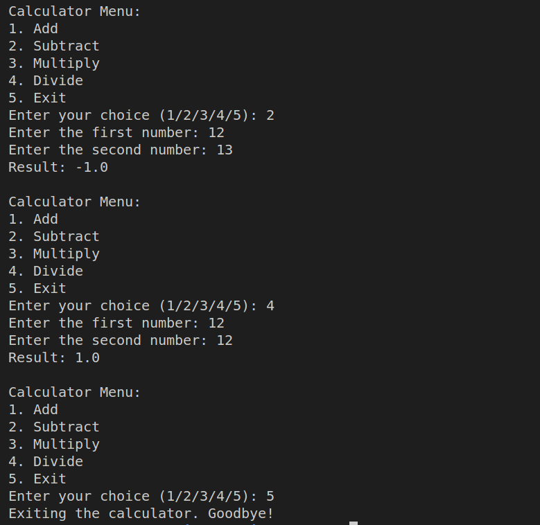

# Simple Calculator


A simple Python program for a basic calculator with basic arithmetic operations. Prompt the user to input two numbers and an operation choice. Perform the calculation and display the result.

## Features

- Addition
- Subtraction
- Multiplication
- Division

## How to Use

1. Clone the repository to your local machine:

    ```bash
    git clone https://github.com/mustafaansarii/PythonVerse/tree/main/Calculator
    ```

2. Run the calculator program:

    ```bash
    python Calculator.py
    ```

3. Follow the on-screen instructions to input two numbers and choose an operation.

## Screenshots


## Contributing

If you'd like to contribute to this project, feel free to fork the repository and submit a pull request.

## License

This project is licensed under the MIT License - see the [LICENSE](CODEWAY/LICENCE.txt) file for details.
