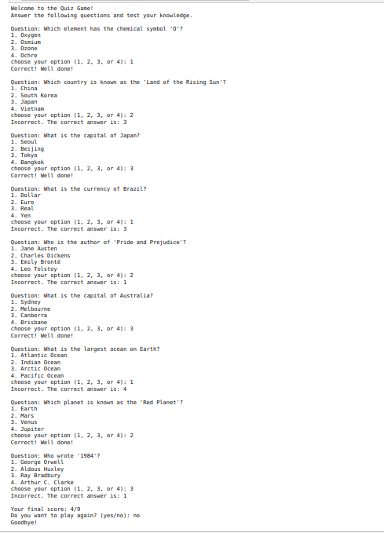

# Quiz Game

A simple Python script for a Quiz Game. Test your knowledge by answering a set of random questions.

## Features

- Questions cover various topics, including geography, science, literature, and more.
- Randomized order of questions to keep the game interesting.
- User-friendly interface for selecting answers.

## How to Play

1. Clone the repository to your local machine:

    ```bash
    git clone https://github.com/mustafaansarii/PythonVerse
    ```

2. Navigate to the project directory:

    ```bash
    cd Weather App
    ```

3. Run the Quiz Game script:

    ```bash
    python quiz game.py
    ```

4. Answer each question by choosing the correct option (1, 2, 3, or 4).

5. After completing all questions, the final score will be displayed.

6. Optionally, you can choose to play again.

## Screenshots


