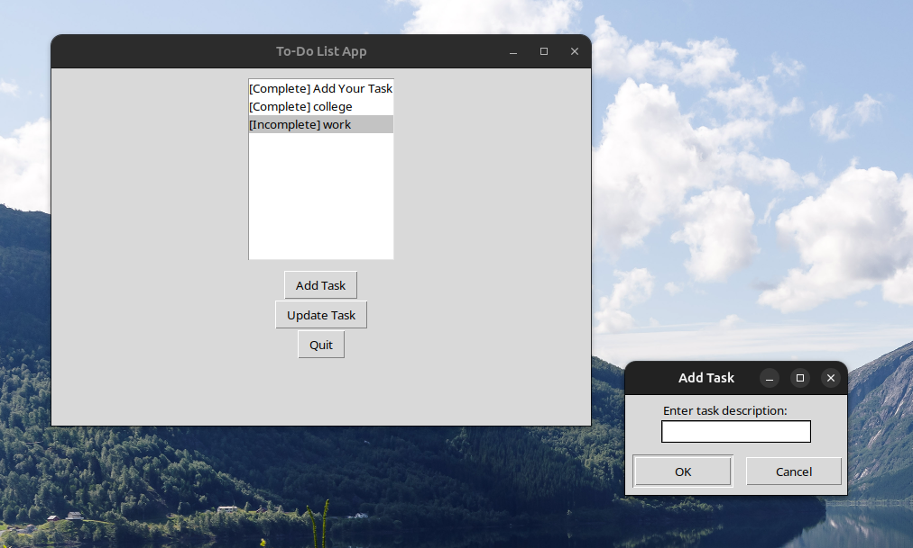

# To-Do List Application

This project is a To-Do List application developed in Python, designed to help users efficiently manage and organize their tasks. The application can be run through the command line. In this README file, you'll find information on how to use the application and a visual representation of the completed task.

## How to Use

1. **Installation:**
   - Clone this repository to your local machine.
   ```bash
   git clone https://github.com/mustafaansarii/CODEWAY.git
   cd CODEWAY/Task-01
   ```

2. **Run the Application:**
   - Execute the following command in your terminal:
     ```bash
     python To-Do_List_Application.py
     ```

3. **Functionality:**
   - Create tasks: Add tasks to your to-do list.
   - Update tasks: Mark tasks as completed or edit task details.
   - Track tasks: View and manage your to-do list easily.

4. **To-Do List Image:**
   

## Task Completed

The following task has been successfully implemented:

- [x] To-Do List Application

## To-Do List Image


## Future Enhancements

- Add due dates to tasks.
- Implement categories for better organization.
- Allow users to prioritize tasks.

Feel free to contribute to this project by submitting issues or pull requests.

Happy task managing! 🚀
