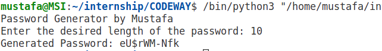

# Password Generator

A Python script to generate random passwords with the specified length.

## Features

- Generates passwords with a mix of uppercase and lowercase letters, numbers, and special characters.
- Easy to use with a customizable password length.

## How to Use

1. Clone the repository to your local machine:

    ```bash
    git clone https://github.com/mustafaansarii/CODEWAY/blob/main/Task-03/password%20generator.py
    ```

2. Navigate to the project directory:

    ```bash
    cd  Task-03
    ```

3. Run the password generator script:

    ```bash
    python password generator.py
    ```

4. Follow the on-screen instructions to input the desired length of the password.

## Screenshots




